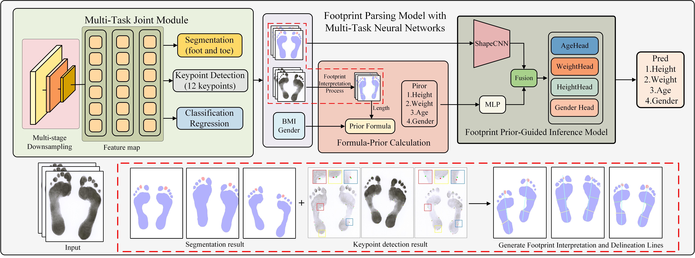

## 🦶 Footprint Parsing Model for Multi-Task Learning and Analysis

**A unified footprint parsing network integrating geometric priors (AFGP) and data-driven correction (DPCM) for multi-task forensic and biometric analysis.**

### 🚀 Overview
**FPMNet** formulates footprint understanding as a **parsing graph problem**, jointly learning segmentation, keypoint detection, and attribute estimation within a unified framework.  
It integrates two key modules:  
- **AFGP (Anthropometric and Footprint Geometric Prior):** extracts interpretable geometric priors such as foot length, width, and ratio factors.  
- **DPCM (Data-driven Prior Correction Module):** adaptively refines predictions through affine correction to enhance stability and structural consistency.  

In addition, we construct **multi-annotation footprint parsing dataset**, which includes semantic masks, anatomical keypoints, and anthropometric labels, providing a unified benchmark for footprint understanding.

---

### 🖼️ Framework Overview

  

<b>Fig. 1.</b> Overall workflow of the proposed FPMNet framework, including the Multi-Task Joint Module, Anthropometric and Footprint Geometric Prior (AFGP), and the Data-driven Prior Correction Module (DPCM).

---

### 🧩 Main Contributions
- A unified framework for footprint segmentation, keypoint detection, and attribute estimation.  
- A multi-annotation benchmark dataset for footprint parsing.  
- Integration of AFGP and DPCM for geometric prior reasoning and adaptive correction.  
- Improved interpretability, physiological consistency, and task synergy.

---

### ⚙️ Code and Dataset
The **code and dataset will be released upon paper acceptance.**  
Stay tuned for updates in this repository.  
*Code and dataset will be released upon paper acceptance.*

---

### 📄 License
This project will be released under the **MIT License** – details will be provided after publication.

---

